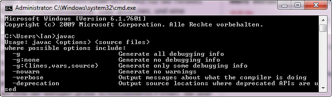
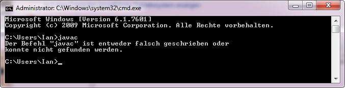
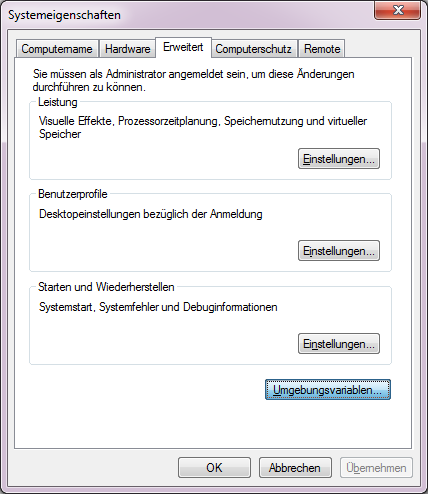
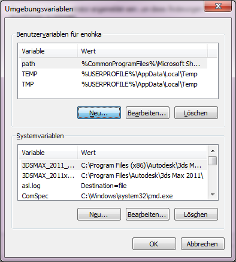
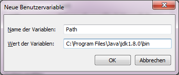
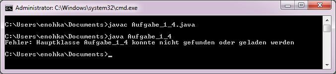
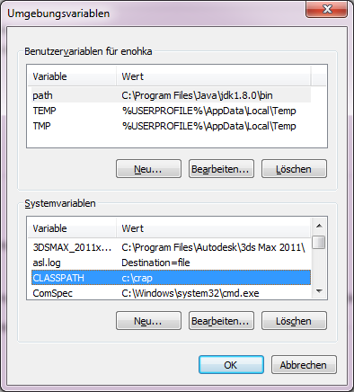

#Guide zum Kompilieren von Java-Programmen in der Windows-Konsole

##Testen ob alles schon funktioniert

Zuerst ein Windows-Konsolen-Fenster öffnen und einfach „javac“ eintippen und mit Enter bzw. Return abschicken.

Wenn das Ergebnis so aussieht wie in Abbildung 1.1 scheint alles schon zu funktionieren.

 
*Abbildung 1.1*

Falls es so aussieht wie in Abbildung 1.2 sollte mit dem nächsten Schritt weiter gemacht werden.

 
*Abbildung 1.2*

Hinweis: am schnellsten öffnet man eine Konsole indem man Windowstaste + R drückt, „cmd“ eintippt und Enter bzw. Return drückt.

##Grundvoraussetzungen

Das JDK (Java Development Kit) muss installiert sein:

Wenn in „Programme/Java“ oder in „Programme (x86)/Java“ kein Unterordner „jdkx.x.x“ zu finden ist, findet man einen Download unter [diesem Link](http://lmgtfy.com/?q=oracle.com%3A+java+development+kit+download).

##Einrichten der „Path“-Benutzervariable

1. Kopiere den Pfad zum „bin“-Unterorder des JDK Orders in den Zwischenspeicher. In meinem Falle ist das „C:\Program Files\Java\jdk1.8.0\bin“
2. Gehe zu „Systemsteuerung“ -> „System“ -> „Erweiterte Systemeinstellungen anzeigen“
3. Im folgenden Dialog auf „Umgebungsvariablen“ klicken.

 
*Abbildung 3.1*

4. Jetzt eine neue Benutzervariable (oben) anlegen. Als Namen sollte „Path“ und als Wert der Pfad zum JDK bin Verzeichnis aus dem Zwischenspeicher genommen werden. 

 
*Abbildung 3.2*

 
*Abbildung 3.3*

5. Konsole neu starten und erneut mit „javac“ testen 

*Hinweis: Wenn bereits eine „Path“-Benutzervariable vorhanden ist, anstelle einer Neuen die vorhandene bearbeiten und dem vorhanden Wert erst ein Semikolon „;“ und dann den Pfad zum JDK bin Verzeichnis aus dem Zwischenspeicher anhängen.*

##Troubleshooting

Falls alles ordnungsgemäß eingerichtet ist und ein Fehler wie in Abbildung 4.1 auftritt. Ist höchstwahrscheinlich die „CLASSPATH“-Variable unsachgemäß überschrieben worden. Java benutzt diesen, um Klassen beim Ausführen eines Programms zu finden. 

 
*Abbildung 4.1*

 
*Abbildung 4.2 „CLASSPATH“ ist unsachgemäß überschrieben - unter „C:\crap“ wird wohl keine Aufgabe_1_4.class zu finden sein.*

Um dieses Problem zu umgehen kann Java als Parameter explizit ein Classpath angegeben werden. Siehe Abbildung 4.4.

 
*Abbildung 4.4*