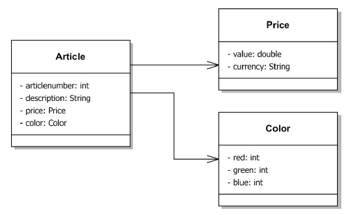

#5.2 - Artikelverwaltung

##Aufgabe 5.2.1

Schreiben Sie ein Programm zur Verwaltung von Artikeln und arbeiten Sie dabei mit Klassen und Objekten.

Ein **Artikel** hat eine Artikelnummer, eine Bezeichnung, eine Farbe und einen Preis.

Eine **Farbe** ist festgelegt durch die drei Grundfarben rot, grün und blau (RGB-Farbraum), deren jeweilige Anteile am Farbton in Form von Integer-Zahlen dargestellt werden können.

Der **Preis** des Artikels soll auch die Bezeichnung der Währung umfassen.

Fügen Sie im Code beliebig viele Artikel in die Artikelliste hinzu. Geben Sie am Ende eine Liste aller erfassten Artikel und deren Attribute aus. Verwenden Sie für die Artikelliste den Typ „Arraylist“ wie folgt:

	import java.util.ArrayList;
	import java.util.List;

	List<Article> lstArticles = new ArrayList<Article>();
	Article article1 = new Article();
	    
	//Add item to lstArticles
	lstArticles.add(article1);

(Zusatz) Programmieren Sie eine Erfassungsmaske (in der Konsole/Command-Line), welche es dem Benutzer erlaubt, beliebig viele Artikel in die Artikelliste hinzuzufügen. Möchte der Benutzer keine weiteren Artikel mehr hinzufügen, gibt das Programm eine Liste aller erfassten Artikel (mit Bezeichnung, Artikelnummer, Preis, Währung und Farbe) aus.

Das schematische Klassendiagramm sieht wie folgt aus:

##Aufgabe 5.2.2

Erweitern Sie das bestehende Programm. Suchen Sie einen bestimmten Artikel anhand seiner Artikelnummer und geben Sie ihn aus. Sollte der Artikel nicht in Ihrer Liste vorhanden sein, muss eine Meldung ausgegeben werden, beispielsweise „Article not found“.

##Aufgabe 5.2.3

Erweitern Sie nun ihr Programm so, dass alle Artikel mit einem bestimmten Preis ausgegeben werden, z.B. der Preis soll größer 100€ sein. Hier ist wiederum auf die Benutzerführung zu achten. Wird der Artikel nicht gefunden, soll eine Meldung erscheinen, z.B. „No articles found“.

##Aufgabe 5.2.4 [Zusatzaufgabe]

Erweitern Sie ihr Programm um die Klasse Warenkorb. In diesem Warenkorb können beliebig viele Artikel gespeichert werden. Zusätzlich soll es noch folgende Funktionen haben:

* int getSize(): Gibt die Anzahl der beinhalteten Artikel zurück
* void addArticle(Article a): Fügt einen Artikel der Liste hinzu
* List<Article> getArticles(): Gibt alle Artikel als Liste zurück
* Boolean remove(int articleNumber): Löscht einen Artikel aus der Liste
* void print(): Gibt alle Artikel, deren Preise und Gesamtpreis aller Artikel auf der Console aus
* int getNewArtNr(): Generiert eine neue Artikelnummer und gibt diese zurück