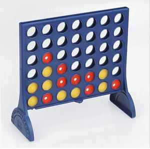

#5.5 - Vier gewinnt

Programmieren Sie ein Vier-Gewinnt spiel, das von zwei Spielern mit Hilfe einer Konsolen-Eingabe bedient werden kann. Arbeiten Sie dabei mit Klassen und Methoden („objektorientiert“).

Das Spielfeld von Vier-Gewinnt entspricht einer Matrix mit 7 x 6 Feldern. Jeder der beiden Spieler hat Spielsteine in einer bestimmten Farbe (Spieler 1: rot, Spieler 2: gelb). Die Spielsteine werden abwechselnd von oben in das Spielfeld eingeworfen. Es gewinnt der Spieler, dem es gelingt, als Erster vier Spielsteine in horizontaler, vertikaler oder diagonaler unmittelbarer Nachbarschaft anzuordnen. Weitere Details zum Spiel finden sie hier: <http://de.wikipedia.org/wiki/Vier_gewinnt>

Programmieren Sie das Spiel mit Hilfe einer einfachen ANSI-Graphik in der Konsole, wie beispielsweise:

    | 1 | 2 | 3 | 4 | 5 | 6 | 7 |
    -----------------------------
    |   |   |   |   |   |   |   |
    |   |   |   |   |   |   |   |
    | O |   | X |   |   |   |   |
    | O |   | X |   |   |   |   |
    | x | X | O |   |   |   |   |
    | x | O | O |   |   |   |   |
    -----------------------------
    Spieler 1 (O) wirft in Spalte:

Die Spieler werden abwechselnd gefragt, in welche Spalte der nächste Spielstein geworfen werden soll. Die Spalten sind von links nach rechts durchnummeriert. Wählt der Spieler 1, dessen Spielsteine mit O dargestellt werden, im obigen Beispiel die Spalte 5, so wird im nächsten Spielschritt das folgende Spielfeld angezeigt:

    | 1 | 2 | 3 | 4 | 5 | 6 | 7 |
    -----------------------------
    |   |   |   |   |   |   |   |
    |   |   |   |   |   |   |   |
    | O |   | X |   |   |   |   |
    | O |   | X |   |   |   |   |
    | x | X | O |   |   |   |   |
    | x | O | O |   | O |   |   |
    -----------------------------

    Spieler 2 (X) wirft in Spalte:

Nun wird Spieler 2, dessen Spielsteine mit X dargestellt werden, aufgefordert, eine Spalte zu wählen.

Geben Sie eine Meldung aus, sobald einer der beiden Spieler gewonnen hat. Zeigen Sie an, welche Spielsteine für den Gewinn verantwortlich sind (Bemerkung: Dies können mehr als 4 Steine sein). Prüfen Sie, ob eine Spalte noch genügend Platz hat. Geben Sie auch eine Meldung aus, wenn das Spiel ohne Gewinner endet.

    | 1 | 2 | 3 | 4 | 5 | 6 | 7 |
    -----------------------------
    |   |   |   |   |   |   |   |
    |   |   |   |   |   |   |   |
    | O |   | X |   |   |   |   |
    | O |   | X |   |   |   |   |
    | x | X | O |   |   |   |   |
    | x | O | O | O | O |   |   |
    -----------------------------
    Spieler 1 (O) wirft in Spalte: 4
    Spieler 1 (O) hat gewonnen (Steine: 1/2, 1/3, 1/4, 1/5).
    Wollen Sie weiterspielen (J/N)?