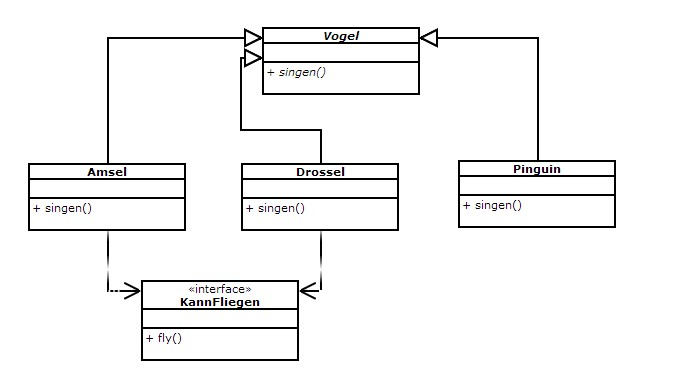

#7.1 - Vogelprogramm

##7.1.1 (Interface)

Erstellen Sie ein Interface „HasName“ mit dem Attribut „String sayHello“ und einer Methode „String getName()“.

##7.1.2 (Abstrakte Klassen)

Gegeben ist folgendes Klassendiagramm. Implementieren Sie die jeweiligen Klassen in Eclipse. Beachten Sie, dass es sich bei der Klasse „Vogel“ um eine abstrakte Klasse mit abstrakten Methoden handelt. Die Klassen „Amsel“, „Drossel“ und „Pinguin“ erben von der Klasse Vogel. Implementieren Sie das Interface „KannFliegen“ nur bei den Vogelarten Amsel und Drossel.

##7.1.3 (Interface implementieren)

Implementieren Sie nun das Interface „HasName“ von Aufgabe 7.1.1 in Ihre Vogelklassen von Aufgabe 7.1.2 und in die Personenklasse von Aufgabe 6.4. 

Geben Sie mit „getName()“ folgendes aus: sayHello + Objekttyp + Name

Beispiele:

    - Hallo ich bin Pinguin Peter (sayHello ist hierbei „Hallo ich bin“)
    - Mein Name ist Person Franz (sayHello ist hierbei „Mein Name ist“)
    - Ich heiße Drossel Dora (sayHello ist hierbei „Ich heiße“)