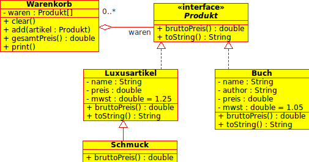

#7.3 - Warenkorb

Programmieren Sie einen Warenkorb nach der Vorgabe des folgenden UML Diagramms. Achten Sie darauf, dass die Attribute mit Hilfe von Konstruktoren gesetzt werden können. Der Bruttopreis eines Produkts wird durch **preis\*mwst** berechnet. Bei **Schmuck** sollen 30% des Preises zusätzlich zur  Mehrwertsteuer zu dem Bruttopreis addiert werden. Hierfür wird die entsprechende, von der Klasse **Luxusartikel** vererbte Methode in der Klasse Schmuck überschrieben. Beachten sie hierbei die Sichtbarkeit (access modifiers) der Attribute.

Die Methode **print()** gibt den Inhalt des Warenkorbs unter Verwendung der **toString()** Methoden der beteiligten Klassen auf dem Bildschirm aus.

