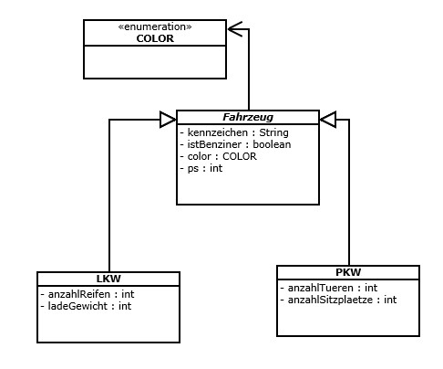

#8.1 - Fahrzeuge

##8.1.1

Erstellen Sie ein Enum. Dieses soll die Konstanten „RED“, „GREEN“, „BLUE“, „YELLOW“ und „BLACK“ annehmen können

##8.1.2

Gegeben ist folgendes schematisches Klassendiagramm. Implementieren Sie die jeweiligen Klassen in Eclipse. Beachten Sie, dass es sich bei der Klasse „Fahrzeug“ um eine abstrakte Klasse handelt. Die Klassen „PKW“ und „LKW“ erben von der Klasse Fahrzeug. Die Attribute entnehmen Sie passend vom schematisches Klassendiagramm. Das Attribut Farbe soll von Aufgabe 15.1 übernommen werden.

##8.1.3

A) Implementieren Sie nun ein Main-Programm, welches eine beliebige Anzahl an PKW-Instanzen beinhaltet. Erstellen Sie in der Klasse PKW eine equals-Methode, die zwei Autos mite8inander vergleichen soll. Zwei Autos sollen gleich sein, wenn die PS-Zahl, die Farbe, die Anzahl der Sitze und der Motortyp übereinstimmen. Testen Sie Ihre Implementierung, indem Sie in der main-Methode mehrere Autos miteinander vergleichen und sich das Ergebnis ausgeben lassen.

B) Implementieren Sie nun ein Main-Programm, welches eine Liste von LKWs beinhaltet. Erstellen Sie in der Klasse LKW eine equals-Methode, die zwei LKWs miteinander vergleichen soll. Zwei LKWS sollen gleich sein, wenn die Anzahl der Ladegewicht übereinstimmen. Testen Sie Ihre Implementierung, indem Sie in der main-Methode mehrere LKWs in der Liste speichern und Sie mit einem weiteren LKW vergleichen. Nutzen Sie dazu die contains-Methode der Liste.

C) Implementieren Sie nun ein Main-Programm, welches eine Liste von Fahrzeugen beinhaltet. Diese Liste beinhaltet alle Fahrzeuge die als gestohlen gemeldet wurden. Wenn die Polizei ein Fahrzeug untersucht, wird die Liste der gestohlenen Wägen auf das Kennzeichen überprüft. Erstellen Sie in der Klasse Fahrzeug eine equals-Methode, die zwei Fahrzeuge miteinander vergleicht. Die Unterklassen können diese Methode mithilfe von „super“ aufrufen. Testen Sie Ihre Implementierung, indem Sie in der main-Methode mehrere Fahrzeuge(PKWs und LKWs) in der Liste speichern und Sie mit einem weiteren Fahrzeugt vergleichen.