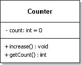

#12.1 - Verschiedene Varianten der Thread Implementierung

Schreiben Sie ein Programm, welches mit 100 Threads gleichzeitig bis 100 zählt. Verwenden Sie hierfür die Klasse aus untenstehendem Klassendiagramm. Zur Implementierung der Zugriffsbeschränkung auf die gemeinsame Variable nehmen Sie die Variante 1 und/oder Variante 2. Auch die dritte Variante ist eine mögliche Lösung des Problems.

Die Methode *„increase()“* soll zusätzlich zu dem Hochzählen der Varibale „count“ den Zählerstand und den Thread, der die Methode aufgerufen hat, ausgeben. Eine mögliche Zeile hierfür ist z.B.

    System.out.println(Thread.currentThread().getName() + "- " + this.count);

##12.1 (Variante 1)

Um die „Zugangskontrolle“ umzusetzen verwenden Sie bitte das aus der Vorlesung bekannte **Monitor-Konzept**. (Stichwort **synchronized**)

##12.1 (Variante 2)

- entfällt -

##12.1 (Variante 3)

Die Zugangskontrolle kann auch mit Hilfe von **„atomic variables“** umgesetzt werden.